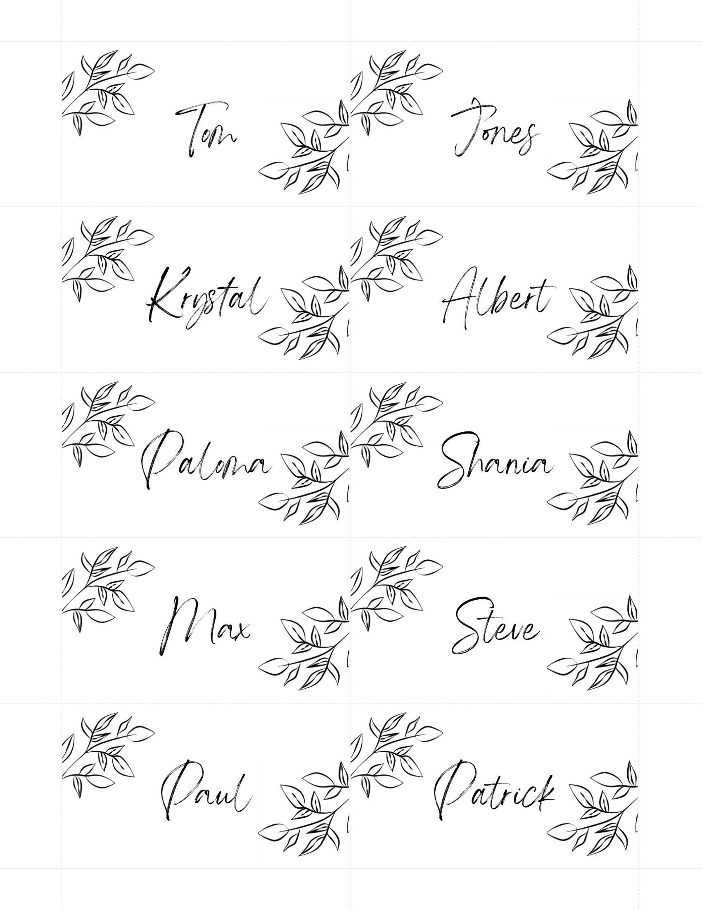

<meta name='keywords' content='Microsoft Word, Merge Fields, Business Card, Wedding Business Card, MailMerge, python'>

# Business Card Generator

## Description

This tool aims to fill variables (of a given dataset input) into Merge Fields of a Microsoft Word Template using Mail Merge library in Python. The main features are:
- Fill/populate Merge Fields from a Microsoft Word file (.docx) from a given dataset (an example is provided in the [business-card-generator.py](business-card-generator.py) code).
- In case of more than 10 rows are contained in the input dataset, the template is replicated into multiple pages.

## Output

Two Microsoft Word (.docx) templates are provided:
1. [Simple Business Card Template](templates/simple_business_card_template.docx)

<p align="center">

</p>

2. [Wedding Business Card Template](templates/wedding_business_card_template.docx) (required font: [Angella White Font](https://www.dafont.com/angella-white.font)).

<p align="center">

</p>


# Usage

## Python dependencies

```.ps1
python -m pip install docx-mailmerge openpyxl pandas
```

## Functions

### business_card_generator
```.py
business_card_generator(df, template, output_name)
```

#### Description
- Fill variables (of a given dataset input) into Merge Fields of a Microsoft Word Template.

#### Parameters
- `df`: *DataFrame*. The DataFrame should include a *name* column, with the names that will be inserted to the Word template file.
- `template`: *str, path object or file-like object*. Word template input file.
- `output_name`: *str, path object or file-like object*. Output of the transformed Word Template input file.
