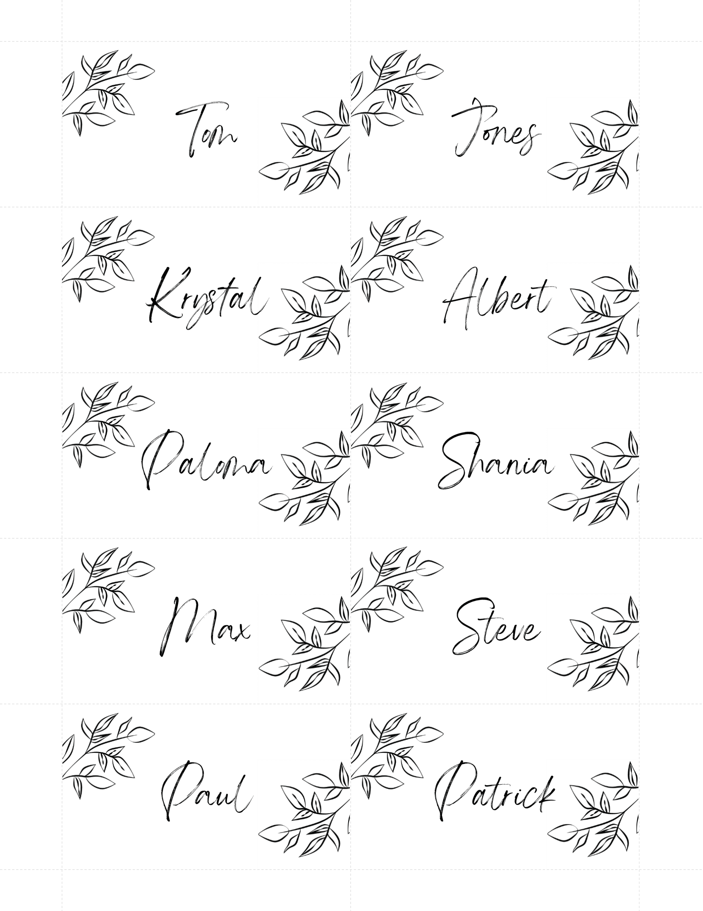

<meta name='keywords' content='Microsoft Word, Merge Fields, Business Card, Wedding Business Card, MailMerge, python'>

# Business Card Generator

This repository contains a code that fills Merge Fields from a Microsoft Word Template from a given dataset using Python. The main features are:
1) Fill/populate Merge Fields from a Microsoft Word file (.docx) from a given dataframe (an example is provided in the [business-card-generator.py](business-card-generator.py) code).
2) In case of more than 10 rows are contained in the input dataset, the template is replicated into multiple pages.

Two templates are provided:   
i. Simple Business Card Template.  
ii. Wedding Business Card Template (required font: [Angella White Font](https://www.dafont.com/angella-white.font)).  

### Python dependencies

```python -m pip install docx-mailmerge lxml pandas```


### Output

The [simple_business_card_template_output.pdf](examples/simple_business_card_template_output.pdf) gives the output of the [simple_business_card_template.docx](templates/simple_business_card_template.docx) template and the [wedding_business_card_template_output.pdf](examples/wedding_business_card_template_output.pdf) gives the output of the [wedding_business_card_template.docx](templates/wedding_business_card_template.docx) template.

<p align="center">

</p>

<p align="center">

</p>
